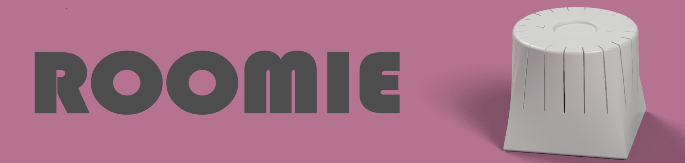
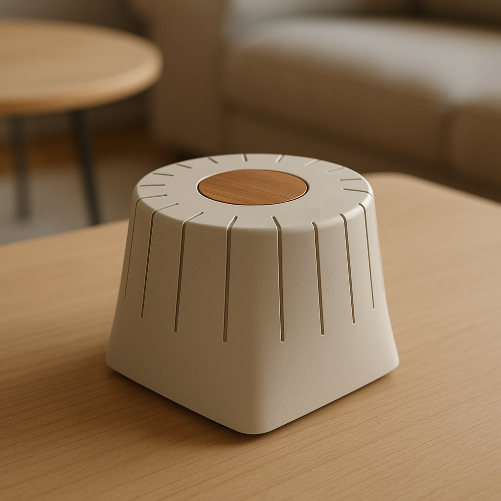
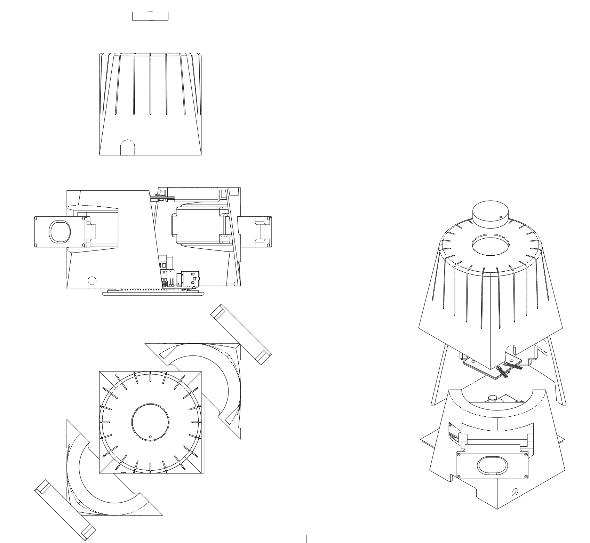

 <!-- Insert a nice rendering or diagram here -->

**Roomie** is a smart home device designed for both kids and adults. It lets users play their favorite music from platforms like Spotify—without needing a smartphone or expensive collectible figures. All it requires are wooden NFC chips (NTAG) that reference a Spotify track or playlist.

---

## 🔧 Features

- 📡 Play music through the built-in speaker or switch to another Spotify-connected device
- 💡 Control playback with NFC chips (Songs, Song forward/backward)
- 📈 Data logging and usage analytics

---

## 🖼️ Rendering / Concept Image



---

## Prototype

First prototype using colored 3D printing material (didn´t turn out to be nice):  


## 📦 Construction/ Bill of Materials




| Component               | Quantity | Description                            | Source / Link                    |
|------------------------|----------|----------------------------------------|----------------------------------|
| Raspberry Pi 4         | 1        | Core controller                         | [RaspberryPi.com](https://...)   |
| PN532                  | 1        | RFID read/write module                  | [Amazon](https://...)            |
| RPI HIFI HAT TAS5713   | 1        | Audio output                            | [Amazon](https://...)        |
| 3D-printed Enclosure   | 1        | Custom case designed for Roomie         | STL files in `/hardware` folder  |
| LuluDa 3W 8Ω Speaker   | 2        | Integrated speaker                      | [Amazon ](https://www.amazon.de/dp/B08QFTYB9Z?ref=ppx_yo2ov_dt_b_fed_asin_title)                               |
| A3144 Hall Sensor      | 2        | For rotation detection                  | [Amazon](https://www.amazon.de/dp/B0CZ6QXMZ2?ref=ppx_yo2ov_dt_b_fed_asin_title )                           |

> 👉 Full parts list available at [`/docs/BOM.md`](./docs/BOM.md)

---

## 🧠 System Architecture

```mermaid
graph TD
    PN532 --> |UID| RaspberryPi
    RaspberryPi --> |UID| Cloud
    Cloud --> |Song ID| RaspberryPi
    RaspberryPi --> Speaker

